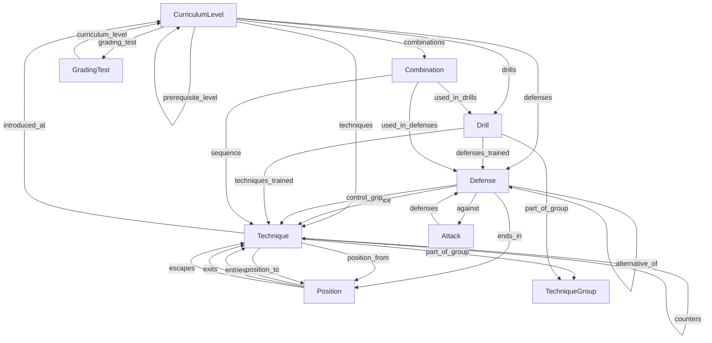

# AAJJ / JJN Ju Jitsu — Curriculum Content Schema

> **Purpose**: Structural schema for representing the JJN Ju Jitsu curriculum as a knowledge graph.
> **Scope**: Senior (Basisteknikker + 5 kyu belts + 1 Dan) and Junior (WBP → GBP → BBP → MBP) tracks.
> **Principle**: Normalize data. Prefer explicit relationships over inferred. Stay minimal but expressive.

---

## 1. Core Content Types

| Type | Description |
|---|---|
| `Technique` | A named, discrete physical action (a throw, a strike, a fall, a lock, etc.) |
| `Attack` | A specific attack scenario an attacker performs (e.g. *strupetak forfra*) |
| `Defense` | A named response to a specific `Attack`; a sequence of one or more techniques |
| `Drill` | A structured, repeatable training exercise with a defined pattern and goal |
| `Combination` | An ordered sequence of techniques executed together (strikes, kicks, or mixed) |
| `CurriculumLevel` | A belt/grade level, within a track (Senior or Junior), with its requirements |
| `GradingTest` | The formal test structure associated with a `CurriculumLevel` |
| `Position` | A named body/spatial state that a technique begins from or ends in |

---

## 2. Shared Base Schema

All content types inherit these fields.

```yaml
base:
  id:          string   # Required. Slug-style unique identifier. e.g. "o-soto-otoshi", "yoko-ukemi"
  name:        string   # Required. Primary human-readable name (Norwegian or Japanese where dominant)
  aliases:     [string] # Optional. Alternate names, romanizations, spelling variants
  japanese:    string   # Optional. Japanese/canonical term (e.g. "yoko ukemi", "osoto otoshi")
  description: string   # Optional. Plain-language explanation of the item
  notes:       string   # Optional. Instructional cues, safety notes, or context
  sources:               # Required. At least one entry. Supports multi-document references.
    - document: string   # Document slug (e.g. "senior/basisteknikker", "junior/gbp")
      page:     string   # Optional. Page or section reference within the document
      notes:    string   # Optional. Traceability note (e.g. "revised Jan 2022", "also in junior/bbp")
```

---

## 3. Extended Schemas per Content Type

### 3.1 Technique

A single named physical action. The atomic unit of the curriculum.

```yaml
Technique:
  extends: base
  # --- Required ---
  category:       enum<TechniqueCategory>  # e.g. "nage", "ukemi", "tsuki", "gatame"
  domain:         enum<Domain>             # "standing" | "ground" | "transition"

  # --- Optional ---
  position_from:  ref<Position>            # Starting position for this technique
  position_to:    ref<Position>            # Resulting position after execution
  target_zone:    enum<BodyZone>           # Where it is directed (e.g. "jodan", "chudan", "gedan")
  limb:           enum<Limb>              # "arm" | "leg" | "head" | "body"
  is_sutemi:      boolean                  # true if this is a sacrifice technique
  safety_note:    string                   # Explicit safety caution (e.g. kubi nage gatame)

  # --- Relationships ---
  introduced_at:  [ref<CurriculumLevel>]   # Levels where this technique is formally introduced
  prerequisites:  [ref<Technique>]         # Techniques that should be learned first
  variations:     [ref<Technique>]         # Structural variants of the same technique
  counters:       [ref<Technique>]         # Techniques that defeat this one
  part_of_group:  ref<TechniqueGroup>      # Which Basisteknikker group it belongs to (if any)
```

### 3.2 Attack

A specific attack a training partner (angriper) performs. Attacks are the trigger for defenses.

```yaml
Attack:
  extends: base
  # --- Required ---
  attack_type:    enum<AttackType>         # "strike" | "grab" | "choke" | "push" | "grapple" | "ground"
  domain:         enum<Domain>             # See §4 Domain vocabulary
  direction:      enum<Direction>          # "frontal" | "rear" | "lateral" | "unspecified"

  # --- Optional ---
  grip_target:    string                   # What is grabbed (e.g. "hår", "klær", "handledd", "hals")
  weapon:         string                   # If relevant (not common in this curriculum)
  techniques_used: [ref<Technique>]        # Techniques the attacker employs

  # --- Relationships ---
  defenses:       [ref<Defense>]           # All defenses catalogued against this attack
```

### 3.3 Defense

A named response sequence to a specific attack. A defense is the primary "scenario" unit in grading requirements.

```yaml
Defense:
  extends: base
  # --- Required ---
  against:        ref<Attack>              # The attack this defense responds to
  sequence:       [ref<Technique>]         # Ordered list of techniques in this defense
  defense_number: string                   # Original curriculum code (e.g. "502", "405", "120")

  # --- Optional ---
  alternative_of: ref<Defense>            # If this is Forsvar 2 / an alternative to another defense
  ends_in:        ref<Position>           # Ending state (e.g. "guard", "standing", "ground-control")
  control_grip:   ref<Technique>          # The terminal control/lock technique, if any
  sparring_safe:  boolean                 # Whether it can be drilled at sparring speed safely

  # --- Relationships ---
  curriculum_levels: [ref<CurriculumLevel>]  # All belt levels where this defense appears
  drills:            [ref<Drill>]            # Drills that train this defense
```

### 3.4 Drill

A repeatable training exercise with a defined structure and purpose goal.

```yaml
Drill:
  extends: base
  # --- Required ---
  domain:         enum<Domain>            # See §4 Domain vocabulary
  goal:           string                  # What physical/technical capacity this develops

  # --- Optional ---
  partner_required: boolean               # true = needs a training partner
  equipment:        [string]              # e.g. ["pads", "boksehansker", "beskyttelsesutstyr"]
  repetitions:      string                # e.g. "4 rep", "5 forsvar"
  duration:         string                # e.g. "2 min"
  resistance_level: enum<ResistanceLevel> # "none" | "light" | "moderate" | "full"

  # --- Relationships ---
  techniques_trained:  [ref<Technique>]      # Which techniques are developed
  defenses_trained:    [ref<Defense>]        # Which defenses are developed
  curriculum_levels:   [ref<CurriculumLevel>] # All belt levels where this drill appears
  part_of_group:       ref<TechniqueGroup>   # If tied to a Basisteknikker group
```

### 3.5 Combination

An ordered sequence of techniques executed fluidly together. Distinct from a Defense (which is reactive) — a Combination may be offensive or pre-planned.

```yaml
Combination:
  extends: base
  # --- Required ---
  sequence:       [ref<Technique>]        # Ordered technique sequence
  domain:         enum<Domain>

  # --- Optional ---
  direction:      enum<Direction>         # "in-fight" | "out-fight" | "unspecified"
  num_strikes:    integer
  num_kicks:      integer
  includes_throw: boolean
  includes_lock:  boolean

  # --- Relationships ---
  curriculum_levels: [ref<CurriculumLevel>]  # All belt levels where this combination appears
  used_in_drills:    [ref<Drill>]
  used_in_defenses:  [ref<Defense>]
```

### 3.6 CurriculumLevel

A belt/grade level in a track. Holds the grading requirements for that level.

```yaml
CurriculumLevel:
  extends: base
  # --- Required ---
  track:          enum<Track>             # "senior" | "junior"
  program:        string                  # e.g. "WBP", "GBP", "BBP", "MBP", "kyu", "dan"
  belt_color:     enum<BeltColor>         # Controlled vocabulary (see §4)
  rank:           string                  # e.g. "5 kyu", "4 kyu", "1 dan", "brunt 2 stripe 1"
  order:          integer                 # Numeric sort order within a track (1 = beginner)

  # --- Optional ---
  min_training_months: integer            # Minimum recommended months since previous level
  min_frequency:       string             # e.g. "2 ganger per uke"
  etiquette_required:  [string]           # Dojo etiquette items required at this level
  equipment_required:  [string]           # Required gear (e.g. "boksehansker", "gi med merker")

  # --- Relationships ---
  prerequisite_level: ref<CurriculumLevel>  # The level that must be passed first
  defenses:           [ref<Defense>]         # Defenses introduced at this level
  techniques:         [ref<Technique>]       # Techniques introduced at this level
  drills:             [ref<Drill>]           # Drills introduced at this level
  combinations:       [ref<Combination>]     # Combinations introduced at this level
  grading_test:       ref<GradingTest>       # The test for this level
```

### 3.7 GradingTest

The formal test structure for advancing through a `CurriculumLevel`.

```yaml
GradingTest:
  extends: base
  # --- Required ---
  curriculum_level: ref<CurriculumLevel>

  # --- Optional ---
  parts:          [GradingTestPart]        # Ordered test segments (see sub-schema below)
  num_attackers:  integer                  # Number of training partners required
  duration:       string                   # Total test duration if stated
  notes:          string                   # Examiner notes (e.g. "ting gjøres riktig > hurtighet")

GradingTestPart:               # Embedded/inline sub-schema — not a top-level node
  label:          string       # e.g. "Del 1", "Tema 2", "Teknisk del"
  description:    string
  defenses:       [ref<Defense>]
  drills:         [ref<Drill>]
  combinations:   [ref<Combination>]
  sparring:       SparringSpec | null

SparringSpec:                  # Inline
  rounds:         integer
  duration_per_round: string   # e.g. "2 minutter"
  type:           enum<SparringType>  # "striking-only" | "grappling-only" | "full"
  head_contact:   boolean
  equipment:      [string]
```

### 3.8 Position

A named physical state — a body configuration or spatial arrangement that serves as the start or end of a technique, or a holding/control state. Promoted to a first-class type so that entry paths, exits, controls, and escapes can be attached without a schema migration later.

```yaml
Position:
  extends: base
  # --- Required ---
  domain:   enum<Domain>            # "standing" | "ground" | "transition"
  category: enum<PositionCategory>  # e.g. "guard" | "hold" | "mount" | "fall"

  # --- Optional ---
  is_control: boolean               # true if this is a dominant control position
  is_escape:  boolean               # true if this is an recovery/escape position

  # --- Relationships (add as data matures) ---
  entries:   [ref<Technique>]       # Techniques that lead into this position
  exits:     [ref<Technique>]       # Techniques executed from this position
  escapes:   [ref<Technique>]       # Techniques used to escape this position (if held)
```

---

## 4. Controlled Vocabularies

### Domain
```
standing | ground | transition | mixed
```

### TechniqueCategory
```
ukemi      # Falling/rolling techniques
sabaki     # Footwork, evasion, blocking
tsuki      # Punching / striking
keri       # Kicking
nage       # Throws
sutemi     # Sacrifice throws (sub-category of nage; is_sutemi = true)
osae       # Pinning/holding positions (ne waza)
gatame     # Locks and control grips
atemi      # Strike to vulnerable point (used within combos/defenses)
```

### TechniqueGroup (Basisteknikker)
Represents the 6 groups from Basisteknikker/Kihon Waza:
```
gruppe-1-ukemi       # Fallteknikk og bevegelsesoppgaver
gruppe-2-sabaki      # Forflytninger, blokkeringer og unnvikelser
gruppe-3-tsuki-keri  # Slag og spark
gruppe-4-nage        # Kast og fellinger
gruppe-5-ne-waza     # På bakken
gruppe-6-gatame      # Kontrollgrep
```

### AttackType
```
strike    # Slag / spark
grab      # Grep (wrist, clothes, hair)
choke     # Strupetak
push      # Dytt
headlock  # Hodelås
grapple   # Omfavning / bodylock
ground    # Attack on the ground (both parties down)
```

### Direction
```
frontal | rear | lateral | unspecified
```

### BeltColor
```
# Senior (kyu → dan)
white | yellow | orange | green | blue | brown | black

# Junior programs (programmatic, not color belts)
junior-white | junior-yellow | junior-orange | junior-green
junior-blue | junior-brown | junior-brown2 | junior-black1 | junior-black2
```

### Track
```
senior | junior
```

### PositionCategory
High-level category for classifying `Position` nodes:
```
guard        # Upright defensive / combat stance (standing or seated)
fall         # Ukemi landing state (side-fall, back-fall, etc.)
hold         # Ne waza pinning/control position (kesa, yoko, tate, etc.)
mount        # Dominant top position (tate shio gatame)
transition   # Intermediate movement state (e.g. technical stand-up phase)
```

### Position — Seed Registry
Known positions to populate at schema init. Each becomes a `Position` node:
```
id: guard              name: Guard / Kamai          category: guard      domain: standing
id: yoi                name: Yoi                    category: guard      domain: standing
id: sitting-guard      name: Sitteguard             category: guard      domain: ground
id: side-fall          name: Yoko ukemi             category: fall       domain: ground
id: back-fall          name: Ushiro ukemi           category: fall       domain: ground
id: hon-kesa-gatame    name: Hon kesa gatame        category: hold       domain: ground    is_control: true
id: yoko-shio-gatame   name: Yoko shio gatame       category: hold       domain: ground    is_control: true
id: ushiro-kesa-gatame name: Ushiro kesa gatame     category: hold       domain: ground    is_control: true
id: tate-shio-gatame   name: Tate shio gatame       category: mount      domain: ground    is_control: true
```

### Zone / CombatRange (Sone)
Referenced in the Basisteknikker philosophy:
```
sone-1   # Clinch range
sone-2   # Close range
sone-3   # Mid range
sone-4   # Long range
```

### BodyZone (Target)
```
jodan    # Head / upper
chudan   # Body / mid
gedan    # Leg / lower
```

### ResistanceLevel
```
none | light | moderate | full
```

### SparringType
```
striking-only | grappling-only | full
```

---

## 5. Relationship Map



---

## 6. Design Decisions & Trade-offs

| Decision | Rationale |
|---|---|
| **`Attack` is a separate type** | Attacks recur across multiple belt levels with different defenses. Normalizing them avoids duplicating attack descriptions inside each Defense node. |
| **`Defense` holds `defense_number`** | The curriculum assigns numeric codes (e.g. 502, 405) per level. Storing these preserves traceability to source documents. |
| **`Combination` is distinct from `Defense`** | Defenses are reactive (triggered by an attack). Combinations are offensive or pre-planned sequences. Conflating them loses this semantic distinction. |
| **`GradingTestPart` is embedded** | Test parts have no standalone identity outside their test; making them a top-level type would add joins with no benefit. |
| **`Position` is a first-class type** | Even though current Position nodes are simple, they are already used as graph references (`position_from`, `position_to`, `ends_in`). Promoting to a type now avoids a painful migration when entry/exit/escape relationships are needed. A `PositionCategory` vocabulary keeps categorization consistent without overengineering individual nodes. |
| **`sources` is a list, not a string** | The same technique or position appears across multiple documents (Junior GBP and Senior Basisteknikker both teach *hon kesa gatame*). A single `source` string would force a choice. A `sources` list with `document`, `page`, and `notes` per entry gives full traceability across revisions and tracks without duplication. |
| **Japanese names as `japanese` field, not primary `name`** | Norwegian names dominate the source material. Japanese terms are stored separately so both are searchable without ambiguity. |
| **`is_sutemi` flag on Technique** | Sutemi (sacrifice throws) require a specific strategic context note. A boolean flag is lighter than a sub-type while still being filterable. |
| **`curriculum_levels` is a list** | A defense, drill, or combination can recur across multiple belt levels (introduced at yellow, tested again at orange; shared between junior and senior tracks). A single `curriculum_level` reference would force duplication of the node itself. A list keeps the node canonical while expressing all contexts where it appears. |
| **No `tags` field** | `tags` was removed from the base schema entirely. Even marked "avoid," a free-form array is a trapdoor — entropy will find it. If categorization is ever needed beyond current structured fields, it must be reintroduced as a controlled enum with validation, not as a free-text bucket. |

---

## 7. Entropy Risks & Safeguards

### Risk 1 — Naming Inconsistencies
**Problem**: The same technique appears under multiple spellings across documents (e.g. *O soto otoshi* / *O soto o toshi* / *osoto otoshi*, *yoko shio* / *yoko shio gatame*).
**Safeguard**: Every `Technique` node has a canonical `id` (slug) and an `aliases` array. All document references are resolved to the canonical `id` at import time. A lookup table of known aliases should be maintained.

---

### Risk 2 — Defense Numbering Drift
**Problem**: Defense codes (e.g. 502, 405) are scoped per belt level but this is implicit. Code 118 and 214 both exist and look similar — future additions could collide.
**Safeguard**: The `defense_number` is stored as a plain string (not a global unique key). The globally unique key is `id` (slug). Code numbers are metadata for source traceability only.

---

### Risk 3 — Overlapping `Attack` Descriptions
**Problem**: "Angriper griper rundt halsen forfra" and "strupetak forfra" describe the same attack in different documents with slightly different phrasing.
**Safeguard**: The `Attack` type is normalized. When ingesting new material, attacks must be matched against the existing attack registry before creating new nodes. A fuzzy-match + human review step is recommended at ingestion time.

---

### Risk 4 — Junior / Senior Track Bleed
**Problem**: Techniques appear in both tracks (e.g. *hon kesa gatame*, *o soto otoshi*) but the grading context differs (junior stripe, senior kyu). Duplicating them conflates "same technique, different curricular context."
**Safeguard**: `Technique` nodes are shared across tracks. `CurriculumLevel` holds the context. The relationship `CurriculumLevel → techniques` records *where* a technique is formally required, not the technique itself. The same `Technique` node can appear in both Senior and Junior `CurriculumLevel` relationships with no duplication.

---

### Risk 5 — Unstructured Drill Descriptions
**Problem**: Drills in the source documents are described in prose (bullet lists), not formal schemas. "Forflytningsdrill" alone appears in at least 3 belt levels referring to progressively extended versions of the same drill.
**Safeguard**: Name drills with versioned or level-scoped IDs (e.g. `forflytningsdrill-del-1`, `forflytningsdrill-del-2`, `forflytningsdrill-full`). Use the `part_of_group` and `curriculum_level` relationships to express progression. Do not merge the parts into a single drill node.

---

### Risk 6 — Combination Explosion
**Problem**: The curriculum describes many ad-hoc strike/kick combinations (1-2, 1-2-3, 1-2-3-4-5-6, etc.) which could proliferate endlessly.
**Safeguard**: Only create `Combination` nodes for sequences that are: (a) explicitly named or codified in a document, or (b) formally required at a specific belt level. Ad-hoc "show 5-6 combinations" instructions belong in `GradingTestPart.description`, not as individual nodes.

---

### Risk 7 — `Position` node sprawl
**Problem**: Position names appear inconsistently across documents (e.g. "guard", "sitteguard", "sitte posisjon", "sideguard"). Because `Position` is now a graph node (not just an enum), duplicates would create broken graph links rather than just messy tags.
**Safeguard**: The seed registry in §4 establishes the canonical set. All document references must resolve to a seed registry `id` at ingestion time. The `aliases` field on each `Position` node captures known spelling variants. New positions may only be added by a curator, not auto-generated from free text.
